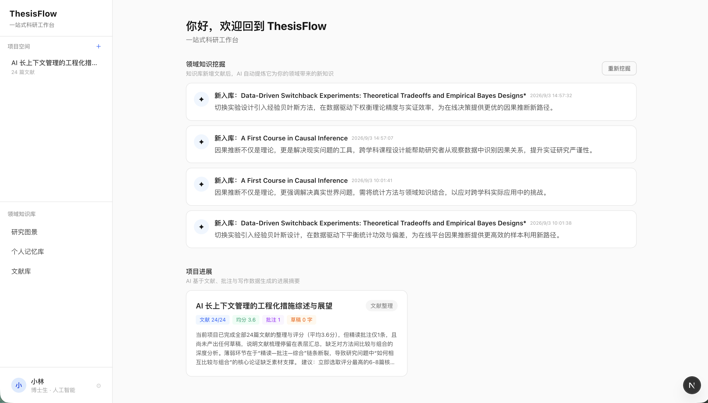
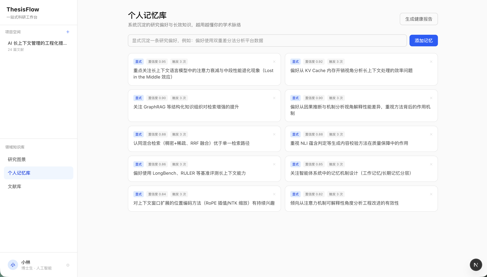
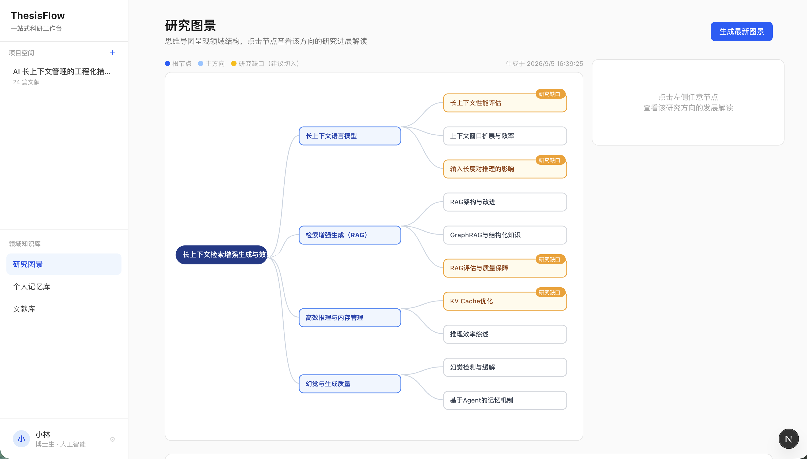
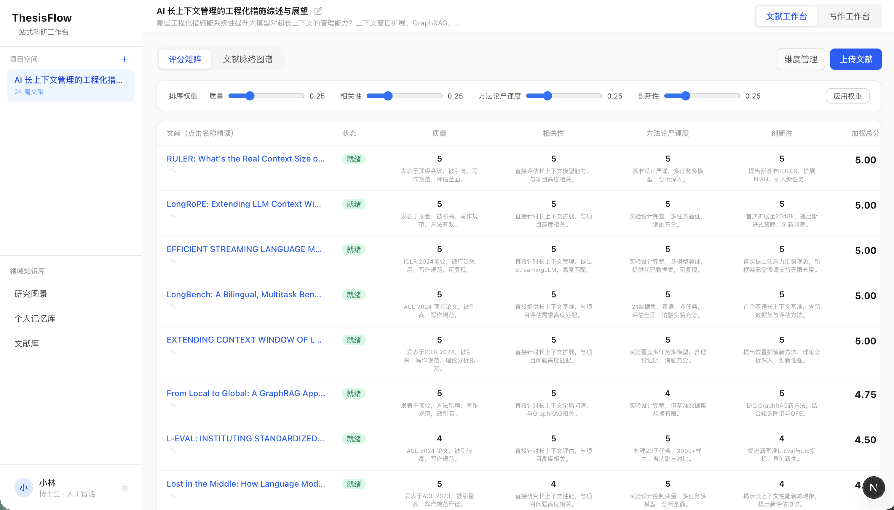
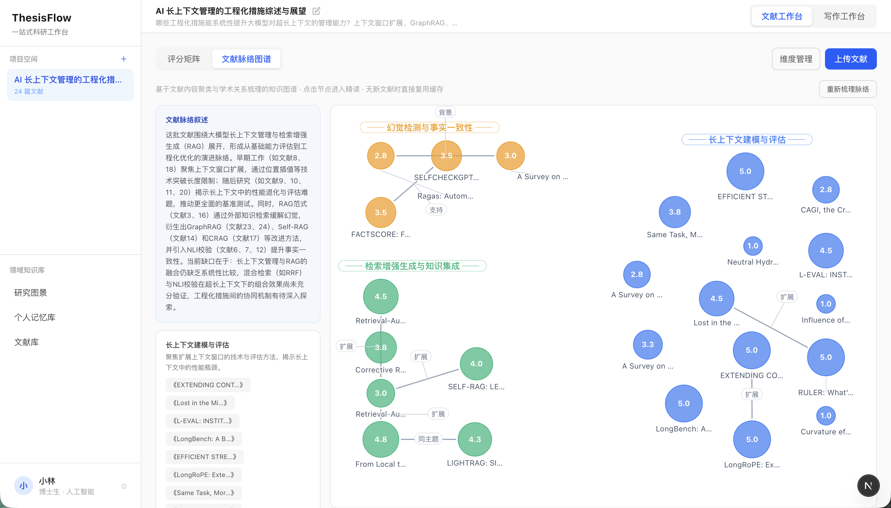
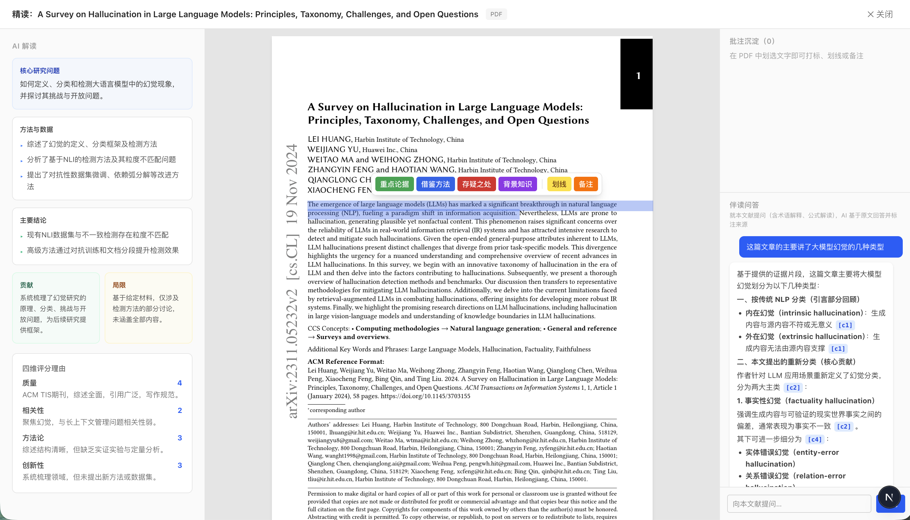
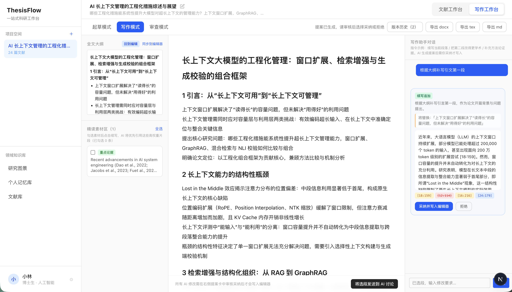
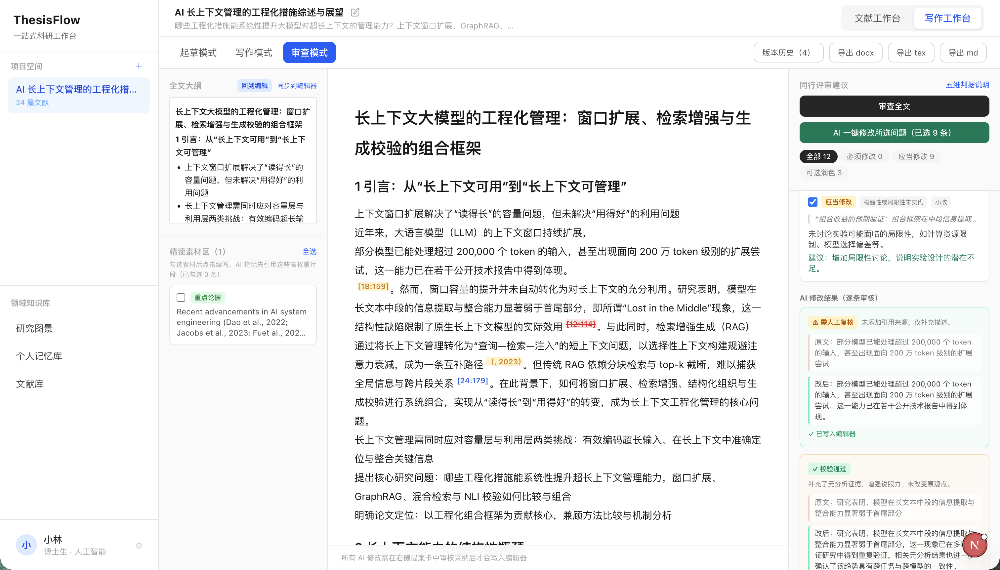
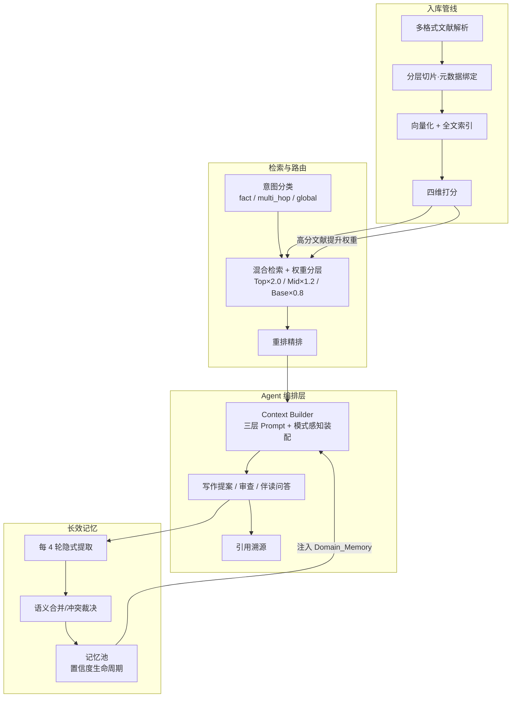

# ThesisFlow · 科研协作智能体 — 作品说明

> 面向面试官/校招评审的 30 秒-10 分钟作品介绍文档。完整产品方案见 [ThesisFlow_PRD_Detailed.md](./ThesisFlow_PRD_Detailed.md)，工程与运行说明见 [README.md](./README.md)，产品全流程讲解手册见 [ThesisFlow_Presentation_Guide.md](./ThesisFlow_Presentation_Guide.md)。

## 30 秒产品卡片

| 项 | 内容 |
|----|------|
| 产品名 | ThesisFlow · 科研协作智能体（可运行 Demo） |
| 一句话定位 | 一站式文献筛选、精读与写作工作台，通过上下文工程实现长效记忆沉淀，让 AI「越用越懂你」 |
| 目标用户 | 各学科高校师生、科研院所研究人员 |
| 核心亮点 | ① 四大模块全链路闭环（入库→筛选→精读→写作）② 长效记忆沉淀（隐式/显式双通道）③ 提案式写作与引用溯源（采纳才落笔 + APA 引用点击定位原文） |
| 技术栈 | Next.js 16 + TypeScript / FastAPI + SQLite / DeepSeek 双模型分级 + 百炼向量化与重排 |
| 体验方式 | 本地一键启动，内置 24 篇真实文献种子数据，随时秒级复位 |

## 一句话定位

一款专为科研工作者打造的 **一站式文献筛选、阅读与写作工作台**：以「全链路工作台 + 长效记忆沉淀」为核心，通过上下文工程把文献、笔记与个人偏好精准调度进每次 AI 交互，让 AI 从通用助手变成「越用越懂你」的科研伙伴。

## 我解决的问题

| 痛点 | 现状 | ThesisFlow 的解法 |
|------|------|------------------|
| 文献多、整理乱 | 几十篇文献散落在文件夹里，横向对比全靠手工 | 批量入库后自动四维打分，按加权总分排序、低分折叠，一键生成脉络知识图谱，快速锁定核心文献 |
| 精读笔记难复用 | 划线批注躺在 PDF 里，写论文时用不上 | 每次划线、打标都自动绑定到对应原文片段并提升其检索权重，写作时这些精读素材被优先召回 |
| AI 不记得"我" | 每次对话从零开始，重复交代研究背景 | 研究画像与个人偏好挂载进每次会话；系统还会从日常讨论中隐式提取新偏好并沉淀进长期记忆池 |
| AI 改稿失控 | 助手大段改写，难以控制与回退 | 提案卡机制：AI 只输出修改提案（含改动说明），用户采纳才写入编辑器，全程留快照可回退 |

## 目标用户

各学科高校师生、科研院所研究人员（Demo 以 AI 领域博士生「小林」为设定角色，产品设计覆盖经济/社科/工程等多学科，详见 PRD 用户画像章）。

## 竞品与差异化

| 竞品 | 定位 | ThesisFlow 差异 |
|------|------|----------------|
| Elicit | 文献发现与摘要 | 只覆盖"发现"环节，没有精读批注与写作工作台 |
| Scite | 引用上下文分析 | 以引用计量为主，不具备写作辅助能力 |
| Notion AI | 通用 AI 写作助手 | 缺少学术工作流深度（四维打分、检索权重路由），无长期记忆体系 |
| Overleaf + AI 插件 | LaTeX 协作编辑 | 轻量补全/润色，无文献管理、知识沉淀与写作全链路 |

**核心差异化**：将「一站式文献工作台 + 长效记忆沉淀」深度融合——既覆盖从选题到成稿的完整科研链路，又通过记忆体系让系统随使用持续进化，是市面上少数把"工作流闭环"与"个人化积累"做进同一产品的科研工具。

## 产品功能地图（四大模块闭环）

```
领域知识库 ──► 文献筛选矩阵 ──► 沉浸式精读 ──► 多模式写作工作台
 研究图景思维导图   四维打分+折叠     结构化预读卡     起草→写作→审查
 个人记忆库         脉络知识图谱      原文划选批注     提案卡+快照回退
 隐式/显式记忆      人工校正校准      伴读问答         大纲/素材引料
    ▲                                                    │
    └────────── 隐式记忆提取 · 反馈学习（自我进化）◄────────┘
```

- **模块一 · 领域知识库**：研究图景思维导图（含研究缺口节点）、个人记忆库（隐式提取 + 显式管理 + 冲突裁决 + 月度健康报告）、知识挖掘动态流；
- **模块二 · 文献筛选矩阵**：PDF/Word/Markdown 批量入库、四维打分（质量/相关性/方法论/创新性，学科锚点校准）、低分自动折叠、自定义权重与维度、人工校正评分（校正作为样例校准后续打分）、脉络知识图谱；
- **模块三 · 沉浸式精读**：一页纸结构化预读、原文划选打标（重点论据/借鉴方法等）、批注实时升权、伴读问答（基于本文档证据回答，答案可点击跳回原文定位）；
- **模块四 · 多模式写作工作台**：起草（商讨 + Markdown 大纲 + 隐式记忆进化）→ 写作（对话生成修改提案卡：追加/修改/删除，采纳才原子写入）→ 审查（五维 17 检查点、一键修改 + 逐条 Diff 采纳、置灰闭环）。

## 产品功能截图

### 模块一 · 领域知识库







### 模块二 · 文献筛选矩阵





### 模块三 · 沉浸式精读



### 模块四 · 多模式写作工作台





## 核心亮点一：一站式工作台 —— 用上下文工程把四个模块串成一条链

工作台的价值不在"功能多"，而在四个环节之间**信息不断流**：每一环节的产出都变成下一环节的上下文输入，这正是上下文工程要解决的核心问题。

```
文献入库 ────► 筛选打分 ────► 沉浸精读 ────► 提案式写作
 解析切片         学科锚点        划线升权        模式感知装配
 绑定页码/章节    研究问题注入    Top Tier ×2.0    起草=骨干摘要
 元数据           打分理由直显    伴读问答        写作=段落窗口+高权重片段
                                                      审查=纯文本
```

- **入库即结构化**：文献被切成带完整元数据的片段（页码/章节/原文坐标），这是后续所有环节共用的最小单位；
- **打分与检索联动**：四维评分不仅用于矩阵排序与折叠，高分文献的摘要还会获得更高检索权重，写作时自然被优先引用；
- **精读即投喂**：在原文上划一条线、打一个标，该片段立即升为最高检索权重——写作时系统会优先"注意"到你精读过的内容；
- **写作按模式装配上下文**：起草模式喂骨干摘要促发散，写作模式喂当前段落 + 高权重片段收聚焦点，审查模式只评文本本身——同一篇文献在不同场景下被裁成不同的上下文，避免 AI 迷失在无关信息里。

## 核心亮点二：长效记忆沉淀 —— 用上下文工程让系统"越用越懂你"

每一次会话都在同一套分层上下文中运行，研究者的身份与偏好不再需要重复交代：

- **三层 System Prompt 动态拼接**：`[Base_Persona]（恒定人设）+ [User_Context]（身份/领域/引用规范）+ [Domain_Memory]（置信度 top-10 条长期记忆，≤1500 tokens）`，随每次请求自动装配；
- **隐式记忆提取**：与 AI 商讨每满 4 轮，系统后台用轻量模型从对话中提取表达出的新研究偏好（方法论倾向、关注变量、写作习惯等）；
- **记忆整合与生命周期**：新偏好与既有记忆做语义比对——高度相似自动合并、疑似冲突弹出裁决卡、全新则入池；每条记忆带置信度，随真实触发频次升降，长期未用的由月度健康报告提醒清理；
- **双向沉淀**：记忆来自"隐式提取"与"显式录入"两条通道，用户可随时查看、编辑、删除——系统学什么，用户说了算。

效果：开启新研究时，系统已经带着过往积累的学术默契参与讨论，从"每次从零开始"变成"越用越懂你"。

## 上下文工程设计要点

在上述两大亮点之下，是一套成体系的上下文调度机制（完整设计见 PRD 第七章设计意图 + 第九章工程实现）：

- **意图路由**：查询先做三分类——事实问答 / 多跳推理 / 全局概览，分别走"精准检索 / 聚类定点 / 物化摘要"三条装配路线，各得其所；
- **检索权重分层**：Top Tier（精读批注 ×2.0）/ Mid Tier（高分文献摘要 ×1.2）/ Base Tier（×0.8），混合检索（稠密+稀疏融合）后经重排精排；
- **模式感知 Token 预算**：三种写作模式各有独立的上下文配额，超出时按"先砍低权重、再压中权重、最后对话历史滑动窗口"三级降级，并明确提示用户；
- **二层缓存与精准失效**：结果缓存（12h）与上下文缓存（3 天），文献就绪、批注升权、记忆变更时精确失效——既省成本，又保证新鲜；
- **双粒度切片**：长文按"父块装配、子块检索"组织，检索命中子块时自动带回父块上下文，减少断章取义；
- **强弱模型分级**：质量敏感的写作/审查走强模型，成本敏感的打分/摘要/记忆提取走轻量模型，二者经统一适配层按"能力槽"路由。

## 技术架构：Agent 编排与流程串联



**模型选型策略**（统一适配层，厂商可切换）：

| 能力槽 | 模型 | 分工 | 选型理由 |
|--------|------|------|---------|
| STRONG | deepseek-v4-pro | 写作 / 审查 / 问答 / 图景 | 质量敏感环节，需要强生成与指令遵循 |
| LIGHT | deepseek-v4-flash | 打分 / 摘要 / 记忆提取 / 语义判定 | 成本敏感的结构化任务，轻量模型足够且便宜 |
| EMBED | text-embedding-v4（百炼，1024 维） | 片段 / 标题 / 查询向量化 | 中英双语专用向量模型，检索质量有保障 |
| RERANK | gte-rerank-v2（百炼） | 检索结果精排 | 交叉编码器精度高于纯向量打分，失败自动降级 |

选型原则：**按任务质量敏感度分级调用、按环节专用化**——该用强模型的地方不省，该用轻量模型的地方不浪费；业务代码只认"能力槽"，模型可随时替换而不影响功能。

## 文档导航

| 文档 | 定位 | 适合 |
|------|------|------|
| 本文 Product_Overview.md | 30 秒-10 分钟快速了解产品 | 初次接触本作品 |
| ThesisFlow_PRD_Detailed.md | 完整产品方案（定位/画像/信息架构/功能设计/上下文工程/技术实现/迭代记录） | 深入了解产品设计细节 |
| README.md | 工程文档（功能全景/技术栈/快速启动/种子数据与重置/已知局限） | 运行与验收项目 |
| ThesisFlow_Presentation_Guide.md | 产品全流程讲解手册（面试演示用：四模块操作动线与讲解要点） | 面试讲解演示 |

## 快速体验

```bash
cd backend && cp .env.example .env   # 填 DeepSeek 与百炼 API Key
python3 serve.py                     # 后端 :8000
cd ../frontend && npm install && npm run dev   # 前端 :3000
```

进入后 24 篇种子文献已就绪，可直接体验「领域知识库 → 文献筛选 → 沉浸精读 → 提案式写作」全流程；数据弄乱时在左下角「个人设置」弹窗底部一键重置（秒级恢复种子状态）。
