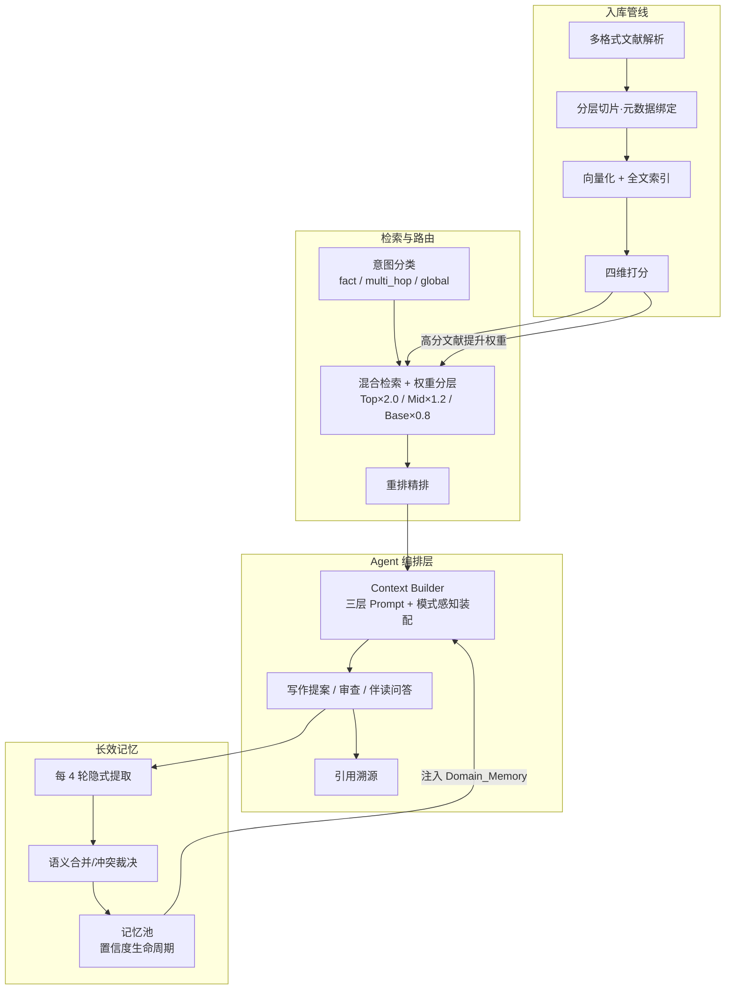

# ThesisFlow · 科研协作智能体 — 作品说明

> 面向面试官/校招评审的 30 秒-10 分钟作品介绍文档。完整产品方案见 [ThesisFlow_PRD_Detailed.md](./ThesisFlow_PRD_Detailed.md)，工程与运行说明见 [README.md](./README.md)，产品全流程讲解手册见 [ThesisFlow_Presentation_Guide.md](./ThesisFlow_Presentation_Guide.md)。

## 30 秒产品卡片

| 项 | 内容 |
|----|------|
| 产品名 | ThesisFlow · 科研协作智能体（可运行 Demo） |
| 一句话定位 | 面向科研任务的 AI 文献与写作工作台，支持文献筛选、精读和可控的人机协作写作 |
| 目标用户 | 各学科高校师生、科研院所研究人员 |
| 核心亮点 | ① 评分与 AI 精读建议分离 ② 阅读重点与批注成果进入写作 ③ 提案采纳才落笔，引用分层校验且可回退 |
| 技术栈 | Next.js 16 + TypeScript / FastAPI + SQLite / DeepSeek 双模型分级 + 百炼向量化与重排 |
| 体验方式 | 本地一键启动，内置 24 篇真实文献种子数据，随时秒级复位 |

## 一句话定位

ThesisFlow 是一款面向科研任务的 **AI 文献与写作工作台**：围绕明确研究问题，把文献筛选、原文精读、批注复用和提案式写作连接起来，减少从整理材料到综述写作的重复查找与返工。长期记忆是持续使用后的附加价值，不是首次使用的前置条件。

## 我解决的问题

| 痛点 | 现状 | ThesisFlow 的解法 |
|------|------|------------------|
| 文献多、难排序 | 四维评分能比较文献，但总分不能直接回答“是否值得精读” | 保留四维评分，另给出“推荐精读／暂不优先／信息不足”和理由；判断结合研究问题、筛选标准与文献内容 |
| 精读笔记难复用 | 划线批注躺在 PDF 里，写论文时用不上 | 每次划线、打标都自动绑定到对应原文片段并提升其检索权重，写作时这些精读素材被优先召回 |
| 引用看似正确 | 来源存在不代表定位正确，也不代表证据支持当前主张 | 提案中分别展示来源、定位和支持性检查，引用可点击返回原文核查 |
| AI 改稿失控 | 助手大段改写，失败时可能丢失输入或覆盖正文 | AI 只输出修改提案；过期、定位失败和写入失败状态明确，内容保留且版本可回退 |

## 目标用户

需要围绕明确研究问题完成文献筛选、证据阅读和带引用写作的高校师生与研究人员。Demo 种子内容聚焦 AI 长上下文工程，但主流程不依赖特定身份或学科。

## 竞品与差异化

| 竞品 | 定位 | ThesisFlow 差异 |
|------|------|----------------|
| Elicit | 文献发现、筛选与研究报告 | ThesisFlow 更强调项目内原文精读、批注复用与提案式写作衔接 |
| Scite | 引用上下文与来源核查 | ThesisFlow 把来源、定位和证据支持检查放到提案采纳前 |
| Notion AI | 通用知识管理与 AI 写作 | ThesisFlow 按研究问题、筛选标准、原文片段和批注用途组织上下文 |
| Overleaf + AI 能力 | LaTeX 协作与写作 | ThesisFlow 当前侧重写作前的筛选、精读成果复用和可回退交互 |

**核心差异化**：不把“功能更多”作为结论，而是把阅读决策、原文证据和可控修改放进同一项目上下文，重点验证能否降低查找、核验和返工成本。

## 产品功能地图（四大模块闭环）

```
领域知识库 ──► 文献筛选矩阵 ──► 沉浸式精读 ──► 多模式写作工作台
 研究图景思维导图   四维打分+折叠     结构化预读卡     起草→写作→审查
 个人记忆库         脉络知识图谱      原文划选批注     提案卡+快照回退
 隐式/显式记忆      人工校正校准      伴读问答         大纲/素材引料
    ▲                                                    │
    └────────── 隐式记忆提取 · 反馈学习（自我进化）◄────────┘
```

- **模块一 · 领域知识库**：研究图景展示当前资料范围内的候选研究问题；个人记忆支持查看、修改、删除与冲突裁决；
- **模块二 · 文献筛选矩阵**：四维评分与 AI 精读建议并列展示，缺失信息不补猜；仅“暂不优先”的低分文献可自动折叠；
- **模块三 · 沉浸式精读**：预读卡增加阅读重点；重点论据、借鉴方法、存疑、背景四类批注按不同用途进入写作；
- **模块四 · 多模式写作工作台**：提案采纳才写入，过期与定位失败可见；引用分别校验来源、定位和证据支持，快照可回退。

## 产品功能模块说明

### 模块一 · 领域知识库 —— 可选的跨任务积累

- **主页全局控制台**：集中展示文献库的知识挖掘动态与各项目的 AI 进展摘要。价值：打开首页即掌握全局进展，不用逐个项目翻找。


- **个人记忆库**：稳定偏好可查看、修改、删除，冲突内容由用户裁决；当前明确指令优先，项目背景不跨范围使用。采纳或拒绝仅记录行为，不直接代表内容正确或来源质量。


- **研究图景思维导图**：基于当前资料组织领域方向与候选研究问题；材料不足时允许不生成候选问题，避免把模型输出包装成已确认的学界空白。


### 模块二 · 文献筛选矩阵 —— 几十篇文献几秒内看清

- **文献筛选矩阵**：四维评分用于结构化比较，AI 精读建议独立判断是否优先阅读并说明理由；无法判断的维度显示信息不足，不猜测期刊或引用数据。推荐精读与信息不足文献不会因低分自动隐藏。


- **文献脉络知识图谱**：自动梳理这批文献的主题聚类与学术关系（扩展/支持/对照等），并生成脉络叙述。价值：一眼看清领域分支与文献间的传承关系，快速锁定核心文献。


### 模块三 · 沉浸式精读 —— 读过的都用得上

- **三栏沉浸精读**：预读卡除核心问题、方法、结论与局限外，明确列出需要核对的方法、结果或限制；批注绑定原文，并按候选论据、方法参考、争议限制、背景说明四种用途进入写作；伴读答案可跳回原文核查。


### 模块四 · 多模式写作工作台 —— 写作又快又可控

- **写作提案卡**：AI 每步只生成追加、替换或删除提案，采纳后才写入。提案分别标注来源存在、定位正确和证据支持；文稿变化后旧提案自动过期，定位或写入失败时保留内容，历史快照支持回退。


- **审查模式建议卡**：写完全篇一键审查，从论证充分性、逻辑连贯性、结构完整性、学术规范性、方法严谨性五个维度生成建议卡，一键修改、逐条确认。价值：交稿前最后一道关，改哪一条由你决定。


## 核心亮点一：阅读成果复用 —— 用上下文工程连接三类任务

工作台的价值不在"功能多"，而在四个环节之间**信息不断流**：每一环节的产出都变成下一环节的上下文输入，这正是上下文工程要解决的核心问题。

```
文献入库 ────► 筛选打分 ────► 沉浸精读 ────► 提案式写作
 解析切片         学科锚点        划线升权        模式感知装配
 绑定页码/章节    研究问题注入    Top Tier ×2.0    起草=骨干摘要
 元数据           打分理由直显    伴读问答        写作=段落窗口+高权重片段
                                                      审查=纯文本
```

- **入库即结构化**：文献被切成带完整元数据的片段（页码/章节/原文坐标），这是后续所有环节共用的最小单位；
- **打分与检索联动**：四维评分不仅用于矩阵排序与折叠，高分文献的摘要还会获得更高检索权重，写作时自然被优先引用；
- **精读即投喂**：在原文上划一条线、打一个标，该片段立即升为最高检索权重——写作时系统会优先"注意"到你精读过的内容；
- **写作按模式装配上下文**：起草模式喂骨干摘要促发散，写作模式喂当前段落 + 高权重片段收聚焦点，审查模式只评文本本身——同一篇文献在不同场景下被裁成不同的上下文，避免 AI 迷失在无关信息里。

## 核心亮点二：可控记忆 —— 作为跨任务附加价值

记忆用于减少稳定偏好与背景的重复交代，但不替代当前任务指令：

- **三层 System Prompt 动态拼接**：`[Base_Persona]（恒定人设）+ [User_Context]（身份/领域/引用规范）+ [Domain_Memory]（置信度 top-10 条长期记忆，≤1500 tokens）`，随每次请求自动装配；
- **隐式记忆提取**：与 AI 商讨每满 4 轮，系统后台用轻量模型从对话中提取表达出的新研究偏好（方法论倾向、关注变量、写作习惯等）；
- **记忆整合与生命周期**：新偏好与既有记忆做语义比对——高度相似自动合并、疑似冲突弹出裁决卡、全新则入池；每条记忆带置信度，随真实触发频次升降，长期未用的由月度健康报告提醒清理；
- **双向沉淀**：记忆来自隐式候选提取与显式录入，用户可随时查看、编辑、删除；当前指令优先于历史偏好，研究问题变化后需重新核查适用性。

预期价值需通过重复任务验证，当前不把模拟会话或单次顺利使用外推为长期收益。

## 上下文工程设计要点

在上述两大亮点之下，是一套成体系的上下文调度机制（完整设计见 PRD 第七章设计意图 + 第九章工程实现）：

- **意图路由**：查询先做三分类——事实问答 / 多跳推理 / 全局概览，分别走"精准检索 / 聚类定点 / 物化摘要"三条装配路线，各得其所；
- **检索权重分层**：Top Tier（精读批注 ×2.0）/ Mid Tier（高分文献摘要 ×1.2）/ Base Tier（×0.8），混合检索（稠密+稀疏融合）后经重排精排；
- **模式感知 Token 预算**：三种写作模式各有独立的上下文配额，超出时按"先砍低权重、再压中权重、最后对话历史滑动窗口"三级降级，并明确提示用户；
- **二层缓存与精准失效**：结果缓存（12h）与上下文缓存（3 天），文献就绪、批注升权、记忆变更时精确失效——既省成本，又保证新鲜；
- **双粒度切片**：长文按"父块装配、子块检索"组织，检索命中子块时自动带回父块上下文，减少断章取义；
- **强弱模型分级**：质量敏感的写作/审查走强模型，成本敏感的打分/摘要/记忆提取走轻量模型，二者经统一适配层按"能力槽"路由。

## 技术架构：Agent 编排与流程串联



**模型选型策略**（统一适配层，厂商可切换）：

| 能力槽 | 模型 | 分工 | 选型理由 |
|--------|------|------|---------|
| STRONG | deepseek-v4-pro | 写作 / 审查 / 问答 / 图景 | 质量敏感环节，需要强生成与指令遵循 |
| LIGHT | deepseek-v4-flash | 打分 / 摘要 / 记忆提取 / 语义判定 | 成本敏感的结构化任务，轻量模型足够且便宜 |
| EMBED | text-embedding-v4（百炼，1024 维） | 片段 / 标题 / 查询向量化 | 中英双语专用向量模型，检索质量有保障 |
| RERANK | gte-rerank-v2（百炼） | 检索结果精排 | 交叉编码器精度高于纯向量打分，失败自动降级 |

选型原则：**按任务质量敏感度分级调用、按环节专用化**——该用强模型的地方不省，该用轻量模型的地方不浪费；业务代码只认"能力槽"，模型可随时替换而不影响功能。

## 文档导航

| 文档 | 定位 | 适合 |
|------|------|------|
| 本文 Product_Overview.md | 30 秒-10 分钟快速了解产品 | 初次接触本作品 |
| ThesisFlow_PRD_Detailed.md | 完整产品方案（定位/画像/信息架构/功能设计/上下文工程/技术实现/迭代记录） | 深入了解产品设计细节 |
| README.md | 工程文档（功能全景/技术栈/快速启动/种子数据与重置/已知局限） | 运行与验收项目 |
| ThesisFlow_P1_产品测评方案.md | P1 测评协议、Prompt 可追溯规则与迭代决策树 | 审查产品证据与测评方法 |
| evaluation/p1/ | 30 张任务卡、24 篇文献清单、试评标准与运行模板 | 执行可复现测评 |
| ThesisFlow_Presentation_Guide.md | 产品全流程讲解手册（面试演示用：四模块操作动线与讲解要点） | 面试讲解演示 |

## 快速体验

```bash
cd backend && cp .env.example .env   # 填 DeepSeek 与百炼 API Key
python3 serve.py                     # 后端 :8000
cd ../frontend && npm install && npm run dev   # 前端 :3000
```

进入后 24 篇种子文献已就绪，可直接体验「领域知识库 → 文献筛选 → 沉浸精读 → 提案式写作」全流程；数据弄乱时在左下角「个人设置」弹窗底部一键重置（秒级恢复种子状态）。
